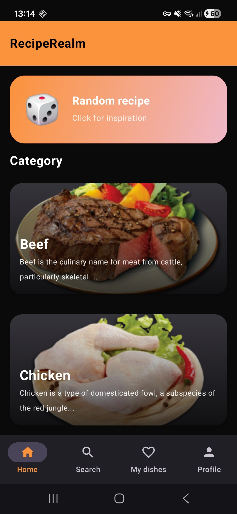
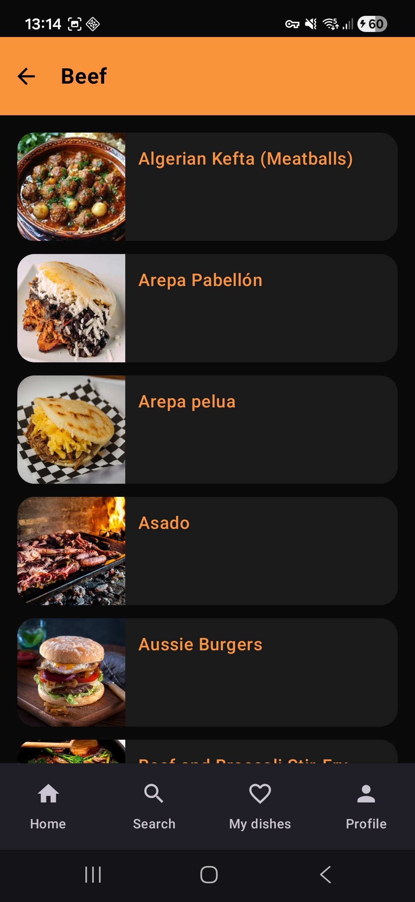
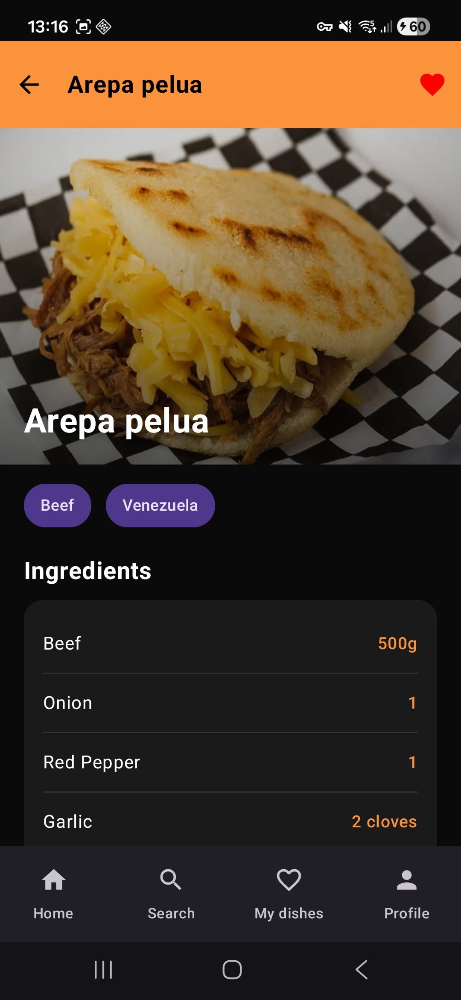
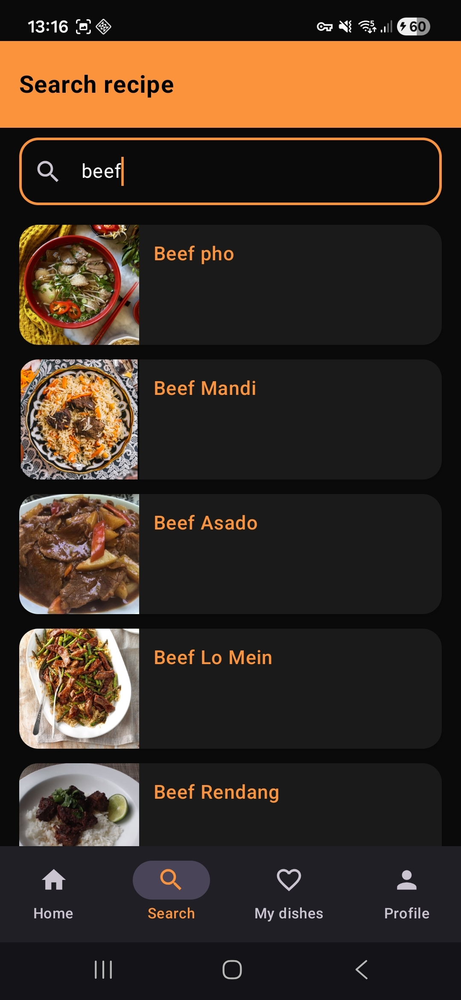
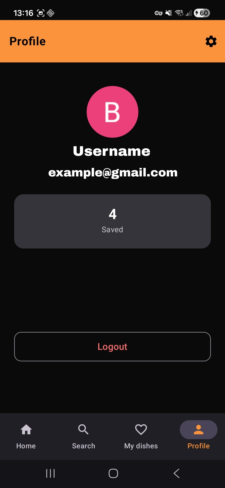
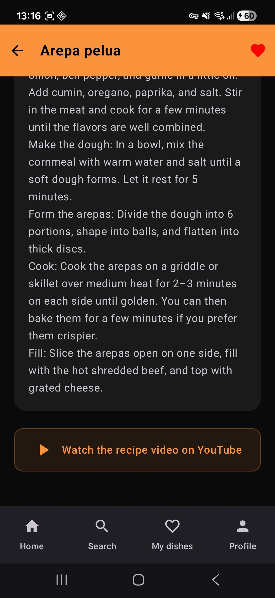
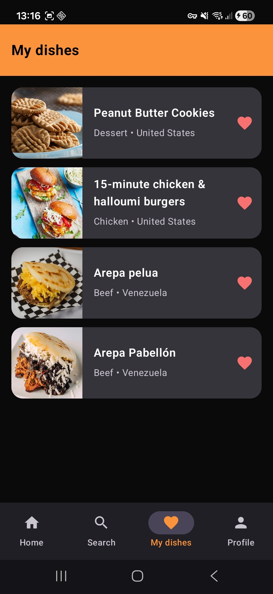
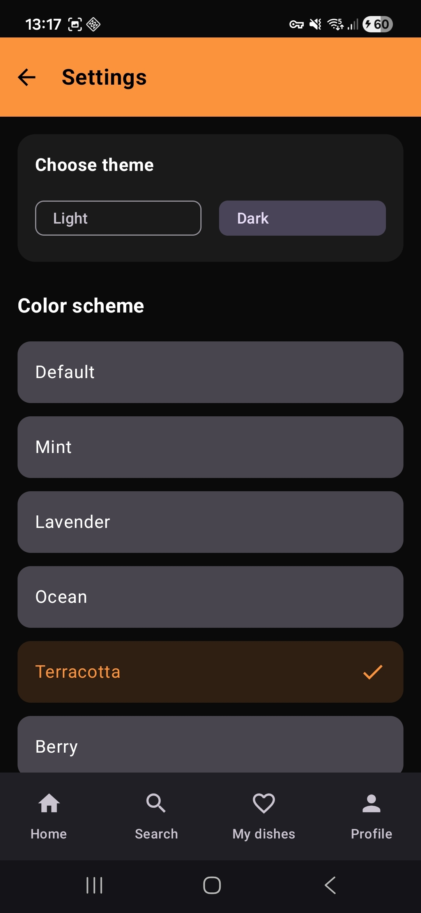

<div align="center">



# 🍽️ RecipeRealm

**Откройте мир вкусов — ищите, сохраняйте, готовьте.**

[](https://kotlinlang.org)
[](https://developer.android.com/jetpack/compose)
[](https://m3.material.io/)
[](https://firebase.google.com)
[](LICENSE)

<br/>







</div>

---

## ✨ О приложении

**RecipeRealm** — это современное Android-приложение для поиска, просмотра и хранения любимых рецептов. Вдохновляйтесь тысячами блюд со всего мира, сохраняйте свои находки и управляйте персональной кулинарной коллекцией — всё в одном красивом приложении.

---

## 🚀 Возможности

| Функция | Описание |
|---|---|
| 🔐 **Авторизация** | Быстрый вход через Google и Firebase Auth |
| 📚 **Категории** | Удобная навигация по типам блюд |
| 🔍 **Умный поиск** | Поиск по названию и ингредиентам |
| 👤 **Мои рецепты** | Личная коллекция только ваших рецептов |
| 🎨 **Темы** | Светлая и тёмная тема на ваш выбор |
| 📺 **YouTube** | Встроенный просмотр видеорецептов |
| 📱 **Material 3** | Современный интерфейс на Jetpack Compose |

---

## 📸 Скриншоты

<div align="center">

| Главная | Блюда | Детали | YouTube |
|:---:|:---:|:---:|:---:|
|  |  |  |  |

| Поиск | Мои блюда | Профиль | Настройки |
|:---:|:---:|:---:|:---:|
|  |  |  |  |

</div>

---

## 🛠️ Технологический стек

```
RecipeRealm
├── 🎨  UI Layer
│   ├── Jetpack Compose       — декларативный интерфейс
│   ├── Material 3            — дизайн-система
│   └── Coil                  — загрузка изображений
│
├── 🧠  Logic Layer
│   ├── Kotlin Coroutines     — асинхронные операции
│   ├── MVVM Architecture     — разделение ответственности
│   └── Navigation Compose    — навигация между экранами
│
├── 💾  Data Layer
│   ├── Retrofit              — сетевые запросы к API рецептов
│   ├── Room                  — локальная база данных
│   ├── Firestore             — облачное хранение рецептов
│   └── DataStore             — настройки и предпочтения
│
└── 🔒  Auth & DI
    ├── Firebase Auth         — аутентификация
    ├── Google Sign-In        — вход через Google
    └── Koin                  — внедрение зависимостей
```

---

## 📋 Требования

- **Android**: минимум 7.0 Nougat (API 24+), цель — Android 15 (API 35)
- **Java**: 17+
- **Kotlin**: 2.0+
- **Google Play Services**: требуется для Google Sign-In

---

## ⚙️ Установка и запуск

### 1. Клонирование репозитория

```bash
git clone https://github.com/YOUR_USERNAME/RecipeRealm.git
cd RecipeRealm
```

### 2. Настройка Firebase

1. Создайте проект в [Firebase Console](https://console.firebase.google.com/)
2. Добавьте Android-приложение с вашим `applicationId`
3. Скачайте `google-services.json` и поместите в папку `app/`
4. Включите **Authentication** (Google Sign-In) и **Firestore** в консоли

### 3. Настройка Google Sign-In

Добавьте в `local.properties`:

```properties
WEB_CLIENT_ID=your_web_client_id_here
```

### 4. Сборка и запуск

```bash
./gradlew assembleDebug
```

Или откройте проект в **Android Studio** и нажмите ▶️ Run.

---

<div align="center">

Сделано с ❤️ и ☕ на Kotlin

⭐ Если проект понравился — поставьте звезду!

</div>
